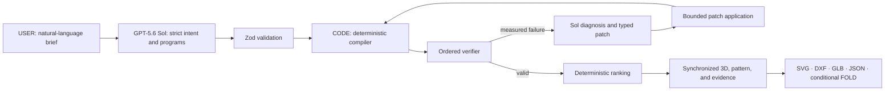

# FoldForge

> Describe a paper object. Get checked designs, a working 3D preview, and fabrication files.

**Live app:** [foldforge.vercel.app](https://foldforge.vercel.app)

FoldForge turns a plain-language brief into a small, bounded flat-sheet design program. GPT-5.6 Sol explores possible programs; deterministic TypeScript compiles the geometry, rejects invalid candidates, applies only bounded repairs, ranks the survivors, and exports the exact selected design.

**The rule:** let AI explore; make code prove.

## Try it in 30 seconds

Live GPT-5.6 generation is deliberately off until model access is activated. The deployed app is still testable:

1. Open the [live app](https://foldforge.vercel.app).
2. Select **Explore a finished example**.
3. Press **Closed** and **Open**, rotate the 3D view, and switch to **Cut-and-fold pattern**.
4. Download SVG, DXF, GLB, or JSON. FOLD appears only when the mechanism can be represented without losing information.
5. On the **Duck-shaped gift box** card, choose **Open finished design** to inspect and download a fold-only FOLD file.

The saved example is labelled as prepared in advance. It is never presented as a response to the text box.

| Playing-card box                                                                       | Pop-up flower card                                                                             | Duck-shaped gift box                                                         |
| -------------------------------------------------------------------------------------- | ---------------------------------------------------------------------------------------------- | ---------------------------------------------------------------------------- |
|  |  |  |
| Slide-out packaging                                                                    | Motion-rich prepared demo                                                                      | Fold-only FOLD demo                                                          |

## The problem

Product, packaging, exhibit, operations, and rapid-prototyping teams often move a brief through several disconnected steps: interpret the request, sketch a mechanism, draw panels, check motion and clearances, revise failures, and prepare cutter or CAD files. A language model can suggest ideas, but prose and plausible-looking coordinates are not fabrication evidence.

FoldForge keeps exploration and proof separate. It compresses that handoff into one inspectable pipeline without asking the model to certify its own work.

## How it works



### Who owns what

| Layer                  | May do                                                                                                                               | May not do                                                                      |
| ---------------------- | ------------------------------------------------------------------------------------------------------------------------------------ | ------------------------------------------------------------------------------- |
| **USER**               | State the object, size, material, motion, and limits                                                                                 | —                                                                               |
| **GPT-5.6 Sol**        | Interpret intent, propose bounded programs, diagnose a real verifier report, suggest a typed local patch, write concise instructions | Declare validity, edit trusted geometry, choose a winner, or write export bytes |
| **Deterministic code** | Normalize units, compile panels and joints, verify, apply patches, rank, serialize, hash, preview, and export                        | Invent unstated essential measurements                                          |

All model output is untrusted until it passes a strict Zod contract. The Responses API calls use `store:false`, bounded output, a hashed random safety identifier, no SDK retries, and a 60-second timeout. Repair uses a strict `apply_parameter_patch` function tool.

## What FoldForge can make

Version 1 supports bounded flat-sheet designs:

- one to four sheets and at most 24 simple polygonal panels;
- cuts, score lines, tabs, slots, revolute folds, and prismatic sliders;
- static, open/close, flap, rotate, slide, and expand/collapse behavior;
- direct-ratio, mirrored-pair, pull-tab, and cam-slot couplings; and
- up to three verified, topology-distinct candidates when the feasible set allows it.

It refuses requests that require smooth solid modeling, deformable simulation, electronics, motors, force-dependent behavior, or general closed-loop mechanisms. “Make anything” would be a dishonest promise; the bounded grammar is what makes deterministic checking possible.

## Deterministic proof

Verification is fail-fast. A candidate must pass every stage before scoring:

1. versioned schema, finite values, units, and grammar limits;
2. identifiers, references, connected acyclic topology;
3. nondegenerate panels, holes, ligaments, and net material;
4. joints, tabs, slots, reciprocal connector fit, and clearances;
5. sheet packing and margins;
6. rigid transforms and closure residuals;
7. one canonical static state or 201 fixed motion states plus bounded event samples;
8. collision, travel, clearance, continuity, and dead-state checks;
9. explicit semantic constraints;
10. source-equivalent exports; then
11. deterministic scoring and ranking.

Expected failures are typed results. Invalid candidates cannot be shown as valid, recommended, finalized, or exported.

The repair loop permits at most five cycles and three allowlisted operations per cycle. Each diagnosis must cite an actual report field; duplicate, unrelated, out-of-range, or intent-changing patches are rejected. Every accepted patch recompiles the program and reruns every hard check.

## Preview and export contract

The selected candidate IR drives every view and file. The UI does not maintain a second, decorative copy of the design.

| Format   | Use                                           | Validation                                                                                                     |
| -------- | --------------------------------------------- | -------------------------------------------------------------------------------------------------------------- |
| **SVG**  | Browser, print at 100%, or cutter import      | Physical millimetre dimensions, layer/source equivalence, 50 mm calibration line                               |
| **DXF**  | CAD or CAM; use Zoom Extents and millimetres  | Parsed entities, units, CUT/SCORE/PERFORATION/ENGRAVE layers, source equivalence                               |
| **GLB**  | 3D handoff; play `FoldForge Open Close`       | Khronos-valid binary, selected panels/paths/connectors, hierarchy, 11 motion samples, byte-stable regeneration |
| **JSON** | Full technical record                         | Canonical intent, program, IR, report, score, provenance, and hashes                                           |
| **FOLD** | Origami software when the design is fold-only | Offered only when joints can be represented losslessly; source/profile equivalence                             |

Independent consumer checks parse the showcase DXFs with `dxf-parser`, validate all showcase GLBs with the Khronos glTF Validator with zero errors and warnings, and parse/populate the fold-only duck with the official FOLD JavaScript library. Motion-rich slider/revolute designs intentionally explain why FOLD is unavailable instead of producing a misleading file.

## Technical architecture

```text
src/core/fabrication/          pure schemas, compiler, geometry, motion,
                               verifier, scoring, repair, and exporters
src/server/fabrication-ai/     prompts, Responses API adapters, strict contracts,
                               and bounded orchestration
src/server/security/           signed access subject, origin/body/quota/concurrency gates
src/app/api/                   typed HTTP boundaries and exact export routes
src/components/                concise Describe → Forge → Export interface
tests/                         unit, integration, mutation, property, eval, and browser suites
scripts/                       fixture, artifact, and sealed evaluation runners
```

Core geometry has no React, browser, or OpenAI dependency. OpenAI code is server-only. Checkpoints are versioned browser storage; there is no database.

**Stack:** Next.js 16.2.10, React 19.2.7, strict TypeScript, pnpm, OpenAI JavaScript SDK, Zod, Three.js, React Three Fiber, Vitest, fast-check, Playwright, and V8 coverage.

## Evaluation evidence

The current offline release matrix records:

- **317 passing tests** across 45 files;
- **96.72% statements, 90.19% branches, 97.96% functions, 97.69% lines**;
- **120/120** independently varied valid controls accepted;
- **0/560** hard-invalid mutations accepted, with the correct fail-fast stage in 560/560;
- **50 programs × 10 runs** with zero canonical differences;
- **40/40** seeded failures repaired within one cycle, **20/20** infeasible cases exhausted correctly, and **0/120** hostile patches accepted;
- **15/15** offline end-to-end showcase runs; and
- **7/7** Chromium flows across 390, 768, 1280, and 1440 px, keyboard, reduced-motion, malformed-response, accessibility, preview-control, and download cases.

These results prove deterministic and mocked-contract behavior. They do **not** prove live GPT-5.6 quality. Exact thresholds and reproduction commands are in [EVALS.md](./EVALS.md).

## GPT-5.6 activation status

API credit is active, but no paid result is claimed yet. The software path is complete and fail-closed. Paid evaluation uses a persistent cumulative ledger capped at **$3.70**, below the builder's **$4.00** authorization:

```dotenv
ENABLE_LIVE_OPENAI=true
ENABLE_LIVE_OPENAI_EVALS=true
LIVE_MODEL_KILL_SWITCH=false
LIVE_EVAL_BUDGET_USD=3.70
```

```bash
LIVE_EVAL_BUDGET_USD=3.70 ENABLE_LIVE_OPENAI=true ENABLE_LIVE_OPENAI_EVALS=true LIVE_MODEL_KILL_SWITCH=false pnpm run eval:live
```

The sealed suite uses five unseen prompts and requires at least four complete prompt → strict programs → verify/repair → rank → export → narrative runs. A successful one-case or budget-truncated run is labelled a smoke, never a sealed pass. Until the sealed gate passes, no prepared fixture or partial paid run is counted as release-ready live generation.

## How Codex was used

This project changed substantially through the builder–Codex collaboration:

1. The initial brief focused on one fold-flat phone stand.
2. The builder challenged that scope: the product should demonstrate a reusable 3D fabrication compiler, not one hard-coded object.
3. Codex researched the event requirements and fabrication formats, then proposed a bounded grammar where arbitrary prompts could be attempted without surrendering validation to the model.
4. The builder chose the Work & Productivity audience, the broader compiler direction, the “software proof first” standard, and the requirement that the interface work for non-technical users.
5. Codex implemented the contracts, deterministic core, GPT-5.6 boundary, repair loop, security controls, UI, exports, fixtures, deployment, and documentation.
6. The builder repeatedly asked for harsher judging, simpler language, real examples, and repair of broken preview/export behavior. Codex created adversarial evals, delegated independent geometry/frontend/export/Devpost reviews, reproduced the failures, and integrated the serious findings.

Codex accelerated research, implementation, refactoring, testing, review, and delivery. Human decisions set the ambition, product category, supported scope, honesty boundary, and release bar. Runtime GPT-5.6 Sol has a different job: interpreting an unseen fabrication brief and proposing report-grounded repairs inside the shipped contracts.

This directly addresses the Build Week requirement to explain where Codex accelerated the workflow, where key decisions were made, and how Codex and GPT-5.6 are used. See the [official rules](https://openai.devpost.com/rules), [challenge requirements and judging criteria](https://openai.devpost.com/), and [Devpost submission checklist](https://help.devpost.com/article/126-know-your-submission-steps).

## Run locally

Requirements: Node.js 22+ and pnpm 11+.

```bash
pnpm install
cp .env.example .env.local
pnpm run dev
```

Server-only variables:

- `OPENAI_API_KEY`
- `ENABLE_LIVE_OPENAI` (defaults to `false`)
- `LIVE_MODEL_KILL_SWITCH` (defaults to `false`)
- `DEMO_ACCESS_CODE` (at least 12 random characters)
- `ACCESS_COOKIE_SECRET` (at least 32 random bytes)

Never use a `NEXT_PUBLIC_` prefix for secrets. Do not print, commit, or store them in browser storage. See [PRIVACY.md](./PRIVACY.md).

### Verify the release

```bash
pnpm run check
pnpm run coverage
FC_SEED=20260714 FC_NUM_RUNS=1000 pnpm run test:property
pnpm run eval:offline
pnpm run eval:compiler
pnpm run eval:repair
pnpm run eval:e2e
pnpm run eval:ablation
pnpm run test:e2e
pnpm audit --prod
```

Generate and verify the deterministic showcase pack:

```bash
pnpm run fixture -- --fixture fabrication-showcase-pack --seed 20260714 --output artifacts/fabrication-showcase-pack
pnpm run verify:artifact -- artifacts/fabrication-showcase-pack/manifest.json
pnpm run validate:consumers
```

## Submission position and limits

FoldForge competes in **Work & Productivity**. Its audience is teams that need a reviewable flat-sheet prototype handoff, not a consumer origami toy. The differentiator is prompt → typed program → deterministic proof → exact files.

FoldForge verifies geometry, bounded kinematics, clearances, and export/source equivalence. It does not simulate material deformation, friction, force, fatigue, durability, or manufacturing performance. A generated design still needs normal fabrication review before real use.

The internal score is deliberately harsh: [JUDGE_SCORECARD.md](./JUDGE_SCORECARD.md) records the current evidence score and the exact live proof needed to become submission-ready.

## Project documents

- [FABRICATION_SPEC.md](./FABRICATION_SPEC.md) — normative language and verifier contract
- [DECISIONS.md](./DECISIONS.md) — architecture and product decisions
- [EVALS.md](./EVALS.md) — reproducible results and evidence boundaries
- [PLANS.md](./PLANS.md) — completed work and the remaining live gate
- [JUDGE_RUBRIC.md](./JUDGE_RUBRIC.md) and [JUDGE_SCORECARD.md](./JUDGE_SCORECARD.md) — adversarial judging
- [BUILD_LOG.md](./BUILD_LOG.md) — implementation record
- [submission/VIDEO_SCRIPT.md](./submission/VIDEO_SCRIPT.md) — sub-three-minute live demo plan
- [THIRD_PARTY_NOTICES.md](./THIRD_PARTY_NOTICES.md) — dependency and asset attribution

## License

MIT. See [LICENSE](./LICENSE).
