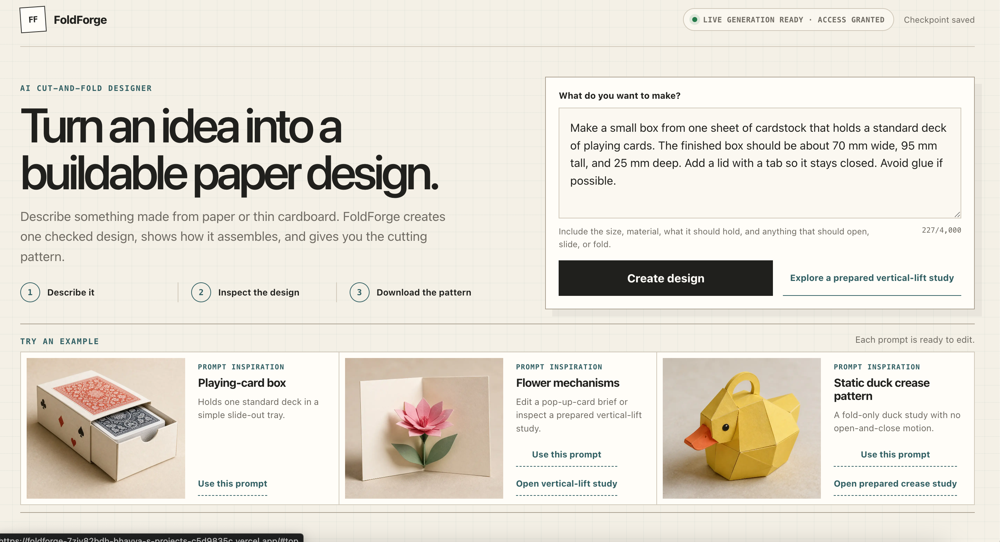
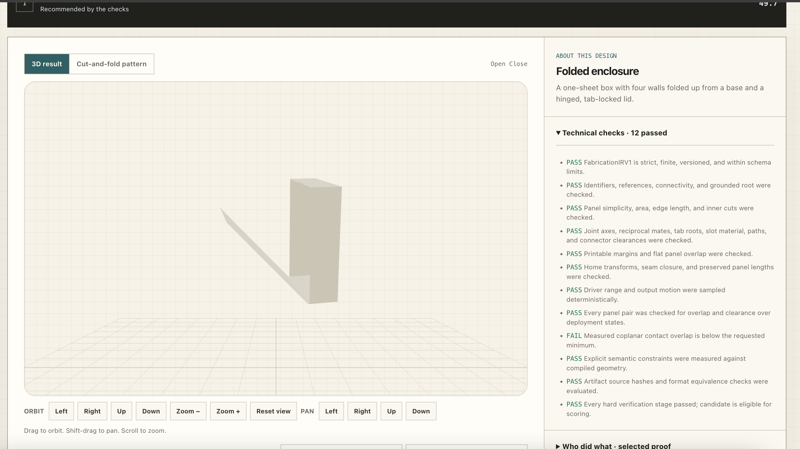
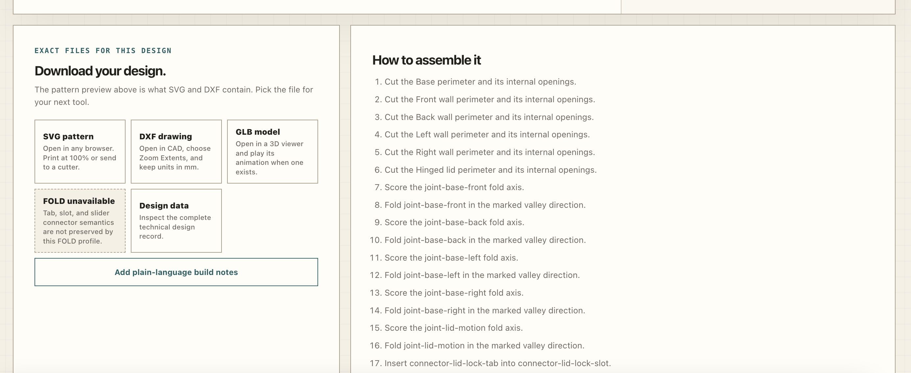
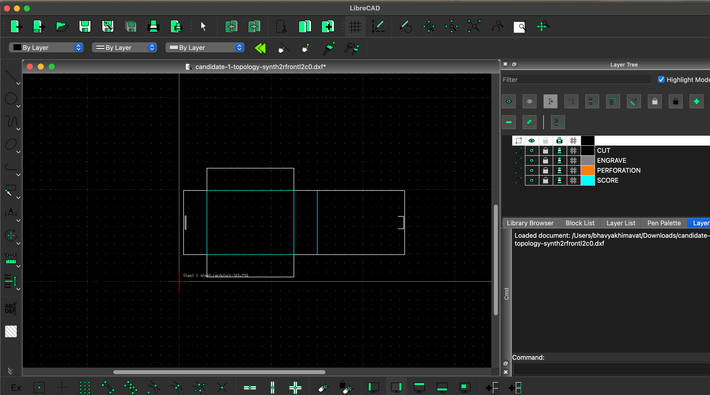
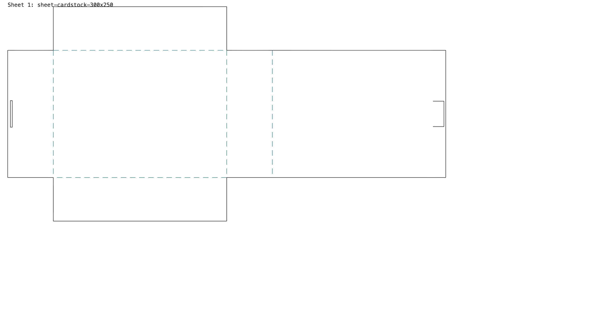
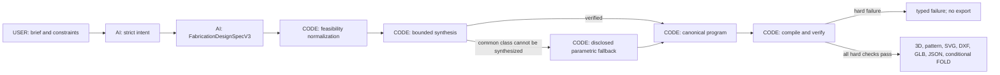

# FoldForge

> Turn a plain-language brief into one checked paper or thin-card design, then inspect the 3D result and download the exact fabrication files.

**Live app:** [foldforge.vercel.app](https://foldforge.vercel.app)

**OpenAI Build Week track:** Work & Productivity

**Core rule:** AI interprets the request; deterministic code owns geometry, validity, and files.



## What FoldForge does

FoldForge joins four normally separate steps:

1. **Describe** — enter an object, finished dimensions, material, and required motion.
2. **Interpret** — GPT-5.6 Sol returns a strict, topology-free `FabricationDesignSpecV3`.
3. **Forge and prove** — deterministic TypeScript synthesizes geometry, compiles it, and runs every hard fabrication check.
4. **Export** — inspect the same selected design as interactive 3D and a flat pattern, then download SVG, DXF, GLB, and canonical JSON. FOLD is offered only when no source meaning would be lost.

The public flow returns one design. A failed or unchecked program is never presented as a valid result.

## See the complete workflow

### 1. Describe the object

The brief states what the object must be, its finished size, its material, and anything that should fold, open, close, slide, or lock. Starter prompts make the input format easy to understand without limiting users to those examples.


### 2. Inspect the generated design and its proof

The Forge view keeps the articulated 3D model, motion controls, cut pattern, measurements, provenance, and verifier report bound to one canonical design. The technical panel exposes measured checks instead of asking the user to trust model prose.



### 3. Download the design and assembly steps

The export stage explains which file fits each downstream tool and generates assembly instructions from the selected program identifiers. FOLD is explicitly marked unavailable when tabs, slots, sliders, or other semantics cannot be represented losslessly.



### 4. Open the fabrication drawing in a real CAD tool

DXF exports use millimetres and separate `CUT`, `SCORE`, `PERFORATION`, and `ENGRAVE` layers. The screenshot below shows a FoldForge DXF opened in LibreCAD.



### 5. Print or cut the source-equivalent flat pattern

SVG exports open in a browser, print at 100%, and carry the same cut and score geometry as the selected design.



## How the system works



### USER, AI, and CODE

| Owner  | Owns                                                                                                                                                        | Does not own                                          |
| ------ | ----------------------------------------------------------------------------------------------------------------------------------------------------------- | ----------------------------------------------------- |
| `USER` | Object, dimensions, material, behavior, fabrication constraints                                                                                             | Internal topology or verifier results                 |
| `AI`   | Intent, semantic parts, relationships, dimension ranges, motion intent, priorities, tolerances                                                              | Trusted coordinates, validity, ranking, or file bytes |
| `CODE` | Normalization, topology, roots, attachment edges, fold directions, connector geometry, packing, compilation, kinematics, verification, scoring, and exports | Inventing missing essential user requirements         |

Every OpenAI response is validated with a strict versioned Zod schema before deterministic code uses it. OpenAI modules remain server-only.

## Synthesis first, transparent fallback second

FoldForge first attempts to realize Sol's semantic specification with the generic bounded synthesizer. That path generates connected acyclic panel graphs, tries compatible physical edges, chooses roots and fold directions, packs the sheet, compiles candidates, and verifies static or swept motion.

Arbitrary semantic-to-fabrication synthesis is not reliable for every object. For common supported classes, a failed generic attempt may fall back to a **parametric** design family fitted to the user's millimetre dimensions:

- folded enclosures with a hinged tab-slot lid;
- static faceted bird figures with body, head, and beak landmarks; and
- pop-up cards with one driven rising panel.

These are code-owned parametric constructions, not AI-authored topology and not pre-rendered assets. The returned provenance records `generationSource: "synthesis"` or `generationSource: "template"` so the two paths are never confused. Requests outside both the generic synthesis envelope and the disclosed families return a typed failure.

## What deterministic code checks

Verification is ordered and fail-fast:

1. schema, version, units, finite values, and grammar limits;
2. identifiers, references, connectivity, and acyclic topology;
3. nondegenerate panels, minimum features, and internal cuts;
4. joints, tab roots, slots, mating geometry, and clearances;
5. sheet packing and printable margins;
6. rigid transforms, closure, and requested dimensions;
7. one canonical static state or 201 motion states plus bounded adaptive samples;
8. collision, travel, branch continuity, and dead states;
9. explicit semantic requirements;
10. source equivalence for the selected exports; and
11. scoring only after every hard check passes.

Model-authored contact and clearance guesses are advisory when the user did not explicitly provide those numeric limits. User constraints and structural geometry checks remain hard.

## One design, one source

Every preview and download is regenerated from the selected candidate's canonical `FabricationIRV1`.

| Format   | Best for                                | Guarantee                                                                   |
| -------- | --------------------------------------- | --------------------------------------------------------------------------- |
| **SVG**  | Browser viewing, 100% printing, cutters | Millimetres, fabrication layers, bounds, calibration, source equivalence    |
| **DXF**  | CAD/CAM handoff                         | Millimetres and named fabrication layers                                    |
| **GLB**  | 3D viewers and animation                | Canonical surfaces, connectors, hierarchy, and motion when present          |
| **JSON** | Audit and programmatic use              | Intent, program, IR, report, score, provenance, versions, and hashes        |
| **FOLD** | Fold-only interchange                   | Emitted only when the supported FOLD profile preserves the design semantics |

Automated consumer checks parse DXF with `dxf-parser`, validate GLB with the Khronos glTF Validator, and parse eligible FOLD files with the official FOLD JavaScript library.

## Reliability work in PRs #20–#29

The latest Claude Code PRs addressed the live `Create design` failures at the contract and synthesis boundaries:

| PR                                                     | Improvement                                                                                                        |
| ------------------------------------------------------ | ------------------------------------------------------------------------------------------------------------------ |
| [#20](https://github.com/BhavyaAk25/FoldForge/pull/20) | Removed an invalid cross-model material-thickness veto and reconciled tab/slot placement in the folded home pose.  |
| [#21](https://github.com/BhavyaAk25/FoldForge/pull/21) | Temporarily captured sanitized failing specifications for offline reproduction.                                    |
| [#22](https://github.com/BhavyaAk25/FoldForge/pull/22) | Removed that temporary capture and stopped unresolvable abstract geometry references from vetoing every candidate. |
| [#23](https://github.com/BhavyaAk25/FoldForge/pull/23) | Steered Sol toward sheets, stock, relations, and lock counts the bounded synthesizer can realize.                  |
| [#24](https://github.com/BhavyaAk25/FoldForge/pull/24) | Added deterministic sheet/thickness normalization and removed redundant model-authored relations.                  |
| [#25](https://github.com/BhavyaAk25/FoldForge/pull/25) | Added synthesis-first, parametric enclosure fallback for common box requests.                                      |
| [#26](https://github.com/BhavyaAk25/FoldForge/pull/26) | Made model-invented contact and clearance targets advisory while retaining hard structural checks.                 |
| [#27](https://github.com/BhavyaAk25/FoldForge/pull/27) | Added explicit `synthesis` versus `template` generation provenance.                                                |
| [#28](https://github.com/BhavyaAk25/FoldForge/pull/28) | Added a verified parametric faceted-figure family for duck and bird prompts.                                       |
| [#29](https://github.com/BhavyaAk25/FoldForge/pull/29) | Added a verified driven pop-up-card family for flower and greeting-card prompts.                                   |

The important architectural lesson was that passing fixtures were not enough: two independent model calls could produce individually valid but mutually incompatible constraints. FoldForge now normalizes that boundary deterministically, attempts generic synthesis first, and exposes when a parametric fallback produced the geometry.

## Supported scope and honest limits

Version 1 supports:

- one to four flat sheets;
- up to 24 simple polygon panels and 24 joints/connectors;
- cuts, scores, tabs, slots, fold/revolute/prismatic joints;
- zero or one motion driver and up to six outputs; and
- static, open/close, flap, rotate, slide, and expand/collapse behavior in an acyclic mechanism.

FoldForge is not unrestricted text-to-CAD. It refuses arbitrary smooth solids, deformable surfaces, electronics, motors, force-dependent behavior, and general closed-loop mechanisms. It checks geometry and bounded kinematics; it does not certify strength, friction, fatigue, durability, material behavior, or manufacturing performance.

The three parametric fallback families improve common demonstrations but do not prove arbitrary-prompt reliability. A valid software result is still a geometrically checked prototype, not a physically certified object.

## Current automated evidence

The latest merged implementation reports:

- **604 Vitest tests** passing;
- coverage of **96.38% statements, 89.84% branches, 98.04% functions, and 97.71% lines**;
- deterministic real-pipeline tests for generic synthesis and each disclosed fallback family;
- **7 Chromium product/accessibility flows** across the required responsive widths;
- seeded property, mutation, repair, repeatability, export-equivalence, and consumer checks; and
- exact-case live Sol evidence preserved separately from broader reliability claims.

The current branch-coverage result is 0.16 percentage points below the configured 90% target after the new fallback work. That is recorded rather than rounded into a pass. See [EVALS.md](./EVALS.md) for the evidence hierarchy, historical paid-test boundary, and reproduction commands. A single successful prompt is not described as universal reliability.

## Architecture

```text
src/core/fabrication/          pure schemas, normalization, synthesis, templates,
                               compiler, geometry, kinematics, verification, exports
src/server/fabrication-ai/     Responses API prompts, strict contracts, model adapters,
                               synthesis-first selection and provenance
src/server/api/                access, origin/body/quota/concurrency policy, diagnostics
src/app/api/                   typed compile, generation, finalization, and export routes
src/components/                concise Describe → Forge → Export interface
tests/                         unit, integration, mutation, property, eval, browser tests
scripts/                       fixtures, consumer validators, sealed evaluation runners
docs/images/                   product and downstream-file screenshots used in this README
```

`src/core` has no React, browser, or OpenAI dependency. Browser checkpoints are versioned, and the application uses no database.

**Stack:** Next.js 16.2.10, React 19.2.7, strict TypeScript, pnpm, OpenAI JavaScript SDK 6.46.0, Zod 4.4.3, Three.js, React Three Fiber, Vitest, fast-check, Playwright, and V8 coverage.

## Run locally

Requirements: Node.js 22+ and pnpm 11+.

```bash
pnpm install
cp .env.example .env.local
pnpm run dev
```

Server-only variables:

- `OPENAI_API_KEY`
- `ENABLE_LIVE_OPENAI` (defaults to `false`)
- `LIVE_MODEL_KILL_SWITCH`
- `DEMO_ACCESS_CODE` (at least 12 random characters)
- `ACCESS_COOKIE_SECRET` (at least 32 random bytes)

Never use a `NEXT_PUBLIC_` prefix for secrets. Do not print, commit, or store them in browser storage.

## Verify without spending credits

```bash
pnpm run check
pnpm run coverage
FC_SEED=20260714 FC_NUM_RUNS=1000 pnpm run test:property
pnpm run eval:offline
pnpm run eval:compiler
pnpm run eval:repair
pnpm run eval:e2e
pnpm run eval:ablation
pnpm run test:e2e
pnpm run validate:consumers
pnpm audit --prod
```

Paid evaluation is never part of an ordinary local check. It requires explicit authorization, live flags, a clean committed build, and a fresh run-specific ledger.

## How AI coding tools were used

The builder made the product decisions: expand beyond the original phone stand, target Work & Productivity, keep the fabrication grammar bounded, return one design, require deterministic proof, cap paid testing, and keep export bytes code-owned.

- **ChatGPT and Codex** helped research the problem, turn it into milestones, build the compiler/verifier/export stack, create adversarial evaluations, improve the interface, and deploy the application.
- **Claude Code** investigated real production failures and implemented PRs #20–#29, including cross-model normalization, connector reconciliation, disclosed parametric fallbacks, and generation-source provenance.
- **GPT-5.6 Sol at runtime** interprets the user's brief and authors the strict intent and semantic design specification. It never certifies its own geometry.

## Repository guide

- [FABRICATION_SPEC.md](./FABRICATION_SPEC.md) — supported grammar and verifier contract
- [DECISIONS.md](./DECISIONS.md) — product and architecture decisions
- [EVALS.md](./EVALS.md) — evidence, thresholds, and live/offline boundaries
- [BUILD_LOG.md](./BUILD_LOG.md) — chronological implementation history
- [PLANS.md](./PLANS.md) — implemented status and remaining evidence boundaries
- [JUDGE_RUBRIC.md](./JUDGE_RUBRIC.md) and [JUDGE_SCORECARD.md](./JUDGE_SCORECARD.md) — adversarial evaluation
- [submission/VIDEO_SCRIPT.md](./submission/VIDEO_SCRIPT.md) — concise demo narration
- [THIRD_PARTY_NOTICES.md](./THIRD_PARTY_NOTICES.md) — dependency notices

## License

MIT. See [LICENSE](./LICENSE).
