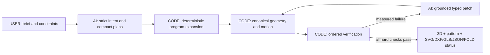

# FoldForge

> FoldForge is designed to turn a bounded flat-sheet brief into typed GPT-5.6 Sol design plans, then make deterministic code expand, verify, and export the fabrication program.

**Track:** Work & Productivity · **Live app:** [foldforge.vercel.app](https://foldforge.vercel.app)

**Core rule:** let AI explore; make code prove.

## What you can try now

The deployed build accepts a bounded paper-design prompt through GPT-5.6 Sol, requests one compact design plan, verifies or repairs it with deterministic code, and shows the result only after every hard check passes. Prepared deterministic examples remain available for immediate inspection without a model call.

To understand the product in under a minute:

1. Open the [live app](https://foldforge.vercel.app).
2. Enter the demo code supplied with the judge instructions.
3. Describe one bounded paper object and select **Create design**.
4. Inspect the checked 3D result and cut-and-fold pattern, then download SVG, DXF, GLB, or JSON.
5. For an instant offline path, open the prepared vertical-lift or static duck study.

The photorealistic concept renders are labelled as prompt inspiration, and the inspectable examples are labelled as prepared. Opening one never pretends that the text box was interpreted or that a concept render is its verified geometry.

| Playing-card box                                                                                                            | Vertical-lift flower study                                                                                                          | Static duck crease pattern                                                                                     |
| --------------------------------------------------------------------------------------------------------------------------- | ----------------------------------------------------------------------------------------------------------------------------------- | -------------------------------------------------------------------------------------------------------------- |
|  |  |  |
| Slide-out packaging                                                                                                         | Prepared direct-lift motion study                                                                                                   | Static fold-only FOLD demo                                                                                     |

## The ten-second explanation

A product brief normally moves through separate sketching, geometry, mechanism, checking, and file-preparation tools. A language model can suggest a plausible design, but plausible coordinates are not proof.

FoldForge is built to turn the brief into a typed fabrication plan, expand one canonical program, measure every hard constraint, repair only bounded parameters, and export the exact verified candidate. Product, packaging, exhibit, operations, and prototyping teams get an inspectable handoff instead of model prose.



This is not text-to-image and it is not unrestricted text-to-CAD. Its deliberately bounded grammar is what makes deterministic checking possible.

## Why this is technically different

### AI explores; code owns truth

| Owner                  | Responsible for                                                                                                                         | Forbidden from doing                                                                  |
| ---------------------- | --------------------------------------------------------------------------------------------------------------------------------------- | ------------------------------------------------------------------------------------- |
| **USER**               | Object, size, material, motion, and fabrication limits                                                                                  | —                                                                                     |
| **GPT-5.6 Sol**        | Normalized intent, compact geometric plans, semantic critique, report-grounded diagnosis, typed parameter patches, concise instructions | Declaring validity, editing compiled coordinates, selecting a winner, exporting bytes |
| **Deterministic code** | Units, geometry, kinematics, verification, patch application, ranking, canonical serialization, hashes, previews, and exports           | Inventing missing essential measurements                                              |

Every model response must pass a versioned Zod contract. OpenAI code is server-only. Responses use `store:false`, bounded output, a random hashed safety identifier, and no model-generation retries. Large planning calls use OpenAI background mode with a bounded 210-second poll inside a 240-second route; only retrievals may retry. Sol now calls one strict compact-plan tool; pure code copies intent-owned fields, selects referenced stock, derives bookkeeping and assembly order, and validates the expanded canonical program. This reduced the model-facing schema from about 25.9 KB to 14.5 KB and representative payloads from 5.9–8.0 KB to 3.1–4.5 KB without using object presets. The compact path passes offline contract and showcase round-trip tests but has not been paid-verified. The final paid attempt on the older full-program contract ended incomplete with `max_output_tokens`; FoldForge rejected it before schema validation, compilation, or export. A failed candidate cannot be ranked, finalized, or exported as valid.

### Verification is ordered and fail-fast

A candidate must pass:

1. schema, version, units, finite values, and grammar limits;
2. identifiers, references, connectivity, and acyclic topology;
3. nondegenerate panels, holes, ligaments, and minimum features;
4. joints, connectors, slots, tabs, and clearances;
5. sheet packing and printable margins;
6. rigid transforms, closure residuals, and requested dimensions;
7. one canonical static state, or 201 motion states plus bounded event samples;
8. collision, travel, clearance, continuity, and dead-state checks;
9. explicit semantic constraints; and
10. source-equivalent exports.

Only then may deterministic scoring run. Repair is limited to five cycles and three allowlisted operations per cycle. Each patch must cite a real verifier failure, preserve the user's intent, and survive a full recompile and recheck.

### One selected model drives every output

| Format   | Purpose                               | Evidence checked                                                                                      |
| -------- | ------------------------------------- | ----------------------------------------------------------------------------------------------------- |
| **SVG**  | Print at 100% or import into a cutter | Millimetre scale, fabrication layers, printable bounds, source equivalence, 50 mm calibration line    |
| **DXF**  | CAD/CAM handoff                       | Millimetres, parsed entities, CUT/SCORE/PERFORATION/ENGRAVE layers, source equivalence                |
| **GLB**  | Articulated 3D handoff                | Khronos-valid surfaces, paths, connectors, hierarchy, conditional animation, byte-stable regeneration |
| **JSON** | Complete technical record             | Intent, program, IR, report, score, provenance, and hashes                                            |
| **FOLD** | Fold-only interchange when lossless   | Exposed only when the topology can be represented without discarding source semantics                 |

The showcase DXFs parse with `dxf-parser`; all showcase GLBs pass the Khronos glTF Validator with zero errors and warnings; and the static duck FOLD file parses and populates faces with the official FOLD library. These are file-compatibility checks, not claims of strength or manufacturing performance.

## Judge-facing evidence

The eval plan was derived from the four official judging criteria: **Technological Implementation, Design, Potential Impact, and Quality of the Idea**. Each point must map to a reproducible screen, report, test, artifact, or source location; the release score uses the lower independent reviewer score rather than an average.

| Criterion                    | What FoldForge is built to demonstrate                                                                                  |
| ---------------------------- | ----------------------------------------------------------------------------------------------------------------------- |
| Technological Implementation | Strict Sol contracts, pure compiler, ordered verifier, bounded repair, source-equivalent exports, adversarial rejection |
| Design                       | Concise Describe → Forge → Export flow with synchronized 3D, pattern, motion, evidence, and downloads                   |
| Potential Impact             | One reviewable brief-to-fabrication handoff for product and operations teams                                            |
| Quality of the Idea          | A reusable typed fabrication grammar broad enough to explore, bounded enough to prove                                   |

Current deterministic evidence:

- **352/352 tests** passing across 50 files;
- **96.72% statements, 90.13% branches, 97.75% functions, 97.66% lines** covered;
- **120/120** varied valid controls accepted;
- **0/560** hard-invalid mutations accepted, with the correct fail-fast stage in 560/560;
- **50 programs × 10 runs** with zero canonical differences;
- **40/40** seeded failures repaired within one cycle, **20/20** infeasible cases exhausted correctly, and **0/120** hostile patches accepted;
- **15/15** offline end-to-end showcase runs; and
- **7/7** Chromium flows spanning 390, 768, 1280, and 1440 px, keyboard use, reduced motion, malformed responses, accessibility, preview controls, and downloads.

These results prove deterministic and mocked-contract behavior. They do not prove live Sol program quality. The current skeptical score is **76/100** because live program generation, grounded live repair, and an exact live-selected artifact remain unproven. Release requires **92/100**, no category below 22/25, and the sealed live gate in [EVALS.md](./EVALS.md).

## Billing safety and live-Sol status

The builder authorized **$4.00** for paid API evaluation. FoldForge uses a lower **$3.70 pre-request reservation ceiling**, preserving a $0.30 planning reserve.

Before each paid request, code reserves the conservative worst-case cost from the exact request's token limit. The same request object is sent to the provider. Reported usage replaces the reservation after success; missing usage or an uncertain request failure charges the reservation, seals the immutable cumulative ledger, and blocks silent retries. If provider-reported usage exceeds its reservation, the ledger records the actual calculated cost—even above $3.70—then seals with no remaining runnable budget. This is a client-side pre-request guard, not a provider-side hard spend cap; a true account-level cap must be configured in provider billing controls. The public evidence stores costs, bounded metadata, and hashes—not prompts, model bodies, credentials, or production reasoning.

Current paid evidence:

- supported intent: strict pass;
- unsupported request: strict refusal;
- prompt-injection attempt: remained inside the strict contract;
- latest guarded complex intent: **18/18** explicit constraints recalled;
- retained final paid compiler summary: **3/3**, charged **$0.11435875**; its raw source report was later overwritten by an offline run, so this item is summary-only rather than independently raw-report reproducible;
- final guarded readiness intent: **18/18** explicit constraints, charged **$0.08897875**;
- first program response: incomplete with `max_output_tokens`, rejected as `budget_usage_invalid`, with zero programs, candidates, repairs, or exports; and
- three immutable chained continuations sealed at a conservative cumulative **$3.6134275**, leaving **$0.0865725** under the pre-request reservation ceiling.

That failure is evidence that strict output and budget boundaries worked, not evidence that live generation works. Production therefore remains live-disabled. The sanitized packet is [submission/evidence/sol-live-evidence.json](./submission/evidence/sol-live-evidence.json).

No further paid request is permitted under the sealed $3.70 reservation ledger: the remaining **$0.0865725** cannot satisfy the conservative reservation guard. No sealed ledger may be edited, reset, or bypassed. Future paid compiler and readiness reports use exclusive run-specific paths so offline evaluation cannot overwrite them again. A final live claim would still require at least four complete successes from a five-case sealed suite on the exact submission build, including strict plans and expanded programs, deterministic verification or repair, ranking, exact exports, and independent checks of the selected bytes; the current evidence does not meet that gate.

## How Codex and GPT-5.6 contributed

The project began as a single fold-flat phone stand. The builder rejected that narrow direction and made the key product decision: build a reusable flat-sheet compiler for Work & Productivity, keep the interface understandable to non-technical users, and never let the model certify itself.

Codex then accelerated the work by:

1. researching fabrication formats and converting the broader idea into a bounded grammar;
2. designing versioned contracts and the pure compiler/verifier boundary;
3. implementing geometry, kinematics, repair, exports, security controls, interface, and deployment;
4. creating property, mutation, adversarial, browser, accessibility, export-consumer, and ablation suites; and
5. running independent geometry, frontend, export, security, and skeptical-judge reviews, then integrating serious findings.

The builder repeatedly made the consequential calls: broaden beyond one object, compete in Work & Productivity, simplify the language, require exact downloads, cap paid testing, and use a harsh judge-derived release threshold.

Runtime GPT-5.6 Sol has a separate role from Codex: interpret a previously unseen brief, propose multiple compact typed fabrication plans, diagnose measured verifier failures, and suggest bounded patches. Deterministic code expands each plan into a canonical program and remains the authority for geometry, validity, ranking, and files.

This README, the commit history, and the required `/feedback` session ID document that collaboration as required by the [official rules](https://openai.devpost.com/rules) and [submission guidance](https://openai.devpost.com/updates/45282-openai-build-week-submissions-are-open-plugin-launch).

## Supported scope

Version 1 supports one to four flat sheets, at most 24 simple polygonal panels, cuts, score lines, tabs, slots, fold/revolute/prismatic joints, one motion driver, and up to six driven outputs. It can express static, open/close, flap, rotate, slide, and expand/collapse behavior with direct-ratio, mirrored-pair, pull-tab, or cam-slot couplings.

It refuses arbitrary smooth solids, deformable surfaces, electronics, motors, force-dependent behavior, and general closed-loop mechanisms. FoldForge checks geometry, bounded kinematics, clearances, and source equivalence. It does not simulate material deformation, friction, force, fatigue, durability, or fabrication performance.

## Architecture

```text
src/core/fabrication/          pure plan expansion, schemas, compiler, geometry,
                               motion, verifier, scoring, repair, and exporters
src/server/fabrication-ai/     Responses API prompts, adapters, contracts,
                               and bounded orchestration
src/server/api/                HTTP security policy, live authorization, and responses
src/server/*.ts                signed access, origin/body/quota/concurrency guards, and audit
src/app/api/                   typed HTTP boundaries and exact export routes
src/components/                concise Describe → Forge → Export interface
tests/                         unit, integration, mutation, property, eval, and browser suites
scripts/                       fixtures, artifact checks, and sealed evaluation runners
```

Core geometry has no React, browser, or OpenAI dependency. OpenAI code is server-only. Checkpoints use versioned browser storage; there is no database.

**Stack:** Next.js 16.2.10, React 19.2.7, strict TypeScript, pnpm, OpenAI JavaScript SDK, Zod, Three.js, React Three Fiber, Vitest, fast-check, Playwright, and V8 coverage.

## Run locally

Requirements: Node.js 22+ and pnpm 11+.

```bash
pnpm install
cp .env.example .env.local
pnpm run dev
```

Server-only variables:

- `OPENAI_API_KEY`
- `ENABLE_LIVE_OPENAI` (defaults to `false`)
- `LIVE_MODEL_KILL_SWITCH` (defaults to `false`)
- `DEMO_ACCESS_CODE` (at least 12 random characters)
- `ACCESS_COOKIE_SECRET` (at least 32 random bytes)

Never use a `NEXT_PUBLIC_` prefix for secrets. Do not print, commit, or place them in browser storage. See [PRIVACY.md](./PRIVACY.md).

For judge testing, put `DEMO_ACCESS_CODE` only in the private Devpost testing instructions. A clean browser asks for it on the first live request; the code must never appear in this repository, a public video, or browser storage.

### Verify the release

```bash
pnpm run check
pnpm run coverage
FC_SEED=20260714 FC_NUM_RUNS=1000 pnpm run test:property
pnpm run eval:offline
pnpm run eval:compiler
pnpm run eval:repair
pnpm run eval:e2e
pnpm run eval:ablation
pnpm run test:e2e
pnpm run validate:consumers
pnpm audit --prod
```

Paid commands require the explicit live-eval flags, an authorized persistent ledger, and the lower $3.70 cap. They are not part of an ordinary local verification run.

## Repository guide

- [FABRICATION_SPEC.md](./FABRICATION_SPEC.md) — grammar and verifier contract
- [DECISIONS.md](./DECISIONS.md) — product and architecture decisions
- [EVALS.md](./EVALS.md) — evidence, thresholds, live/offline boundaries, and reproduction
- [JUDGE_RUBRIC.md](./JUDGE_RUBRIC.md) and [JUDGE_SCORECARD.md](./JUDGE_SCORECARD.md) — adversarial judging and current score
- [PLANS.md](./PLANS.md) and [BUILD_LOG.md](./BUILD_LOG.md) — remaining gate and implementation record
- [submission/VIDEO_SCRIPT.md](./submission/VIDEO_SCRIPT.md) — final narrated demo and rehearsal flow
- [THIRD_PARTY_NOTICES.md](./THIRD_PARTY_NOTICES.md) — dependency and standards notices

## License

MIT. See [LICENSE](./LICENSE).
