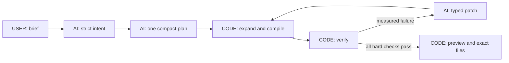

# FoldForge

> Describe a paper or thin-card object. FoldForge turns the brief into one checked design and downloadable fabrication files.

**OpenAI Build Week track:** Work & Productivity · **App:** [foldforge.vercel.app](https://foldforge.vercel.app)

**Rule:** AI proposes the design; deterministic code decides whether it is valid.

## What it does

1. You describe one bounded flat-sheet object, including its size, material, and any required motion.
2. GPT-5.6 Sol converts that request into a strict intent and one compact fabrication plan.
3. Pure TypeScript expands the plan into exact panels, folds, joints, tabs, slots, and motion.
4. The verifier checks geometry, sheet fit, clearances, assembly, motion, collisions, and requested dimensions.
5. A passing design appears in the synchronized 3D and cut-pattern views. You can download the same design as SVG, DXF, GLB, and canonical JSON. FOLD appears only when it can represent the design without losing meaning.

If code finds a repairable failure, Sol may propose a small typed patch. Code applies the patch and reruns every check. The model cannot declare its own work valid.

The compact live path has passed its exact paid local acceptance case. Production promotion and a clean hosted-browser confirmation are the remaining live-delivery checks. The prepared flower and duck studies remain available without spending API credits and are clearly labelled as prepared examples, not prompt results.

| Playing-card box                                                                                                            | Vertical-lift flower study                                                                                                          | Static duck crease pattern                                                                                     |
| --------------------------------------------------------------------------------------------------------------------------- | ----------------------------------------------------------------------------------------------------------------------------------- | -------------------------------------------------------------------------------------------------------------- |
|  |  |  |
| Editable prompt inspiration                                                                                                 | Prepared moving example                                                                                                             | Prepared fold-only example with FOLD                                                                           |

## Who it is for

Packaging, product, exhibit, operations, and prototyping teams often move a brief through separate sketching, geometry, checking, and file-preparation tools. FoldForge explores that handoff as one reviewable workflow: brief → typed plan → measured proof → exact files.

FoldForge is not text-to-image or unrestricted text-to-CAD. Its bounded grammar is what makes deterministic checking possible.

## USER, AI, and CODE

| Owner  | Owns                                                                                                                | Does not own                                                                 |
| ------ | ------------------------------------------------------------------------------------------------------------------- | ---------------------------------------------------------------------------- |
| `USER` | Object, dimensions, material, motion, and fabrication constraints                                                   | —                                                                            |
| `AI`   | Strict intent, one compact semantic plan, a report-grounded diagnosis, and bounded parameter patches                | Validity, compiled coordinates, ranking, export bytes, or verifier overrides |
| `CODE` | Plan expansion, units, geometry, kinematics, verification, repair application, scoring, hashes, previews, and files | Inventing missing essential measurements                                     |



All model responses pass versioned Zod schemas. OpenAI code stays server-only. Planning uses one strict function tool, bounded output, no generation retry, and background response polling within the deployed route budget. The model returns semantic shapes and relationships; code derives identifiers, transforms, packing, connector details, and assembly order without hidden object templates.

## What code checks

Verification is ordered and fail-fast:

1. schema, units, finite values, and grammar limits;
2. identifiers, references, connectivity, and acyclic topology;
3. nondegenerate panels and minimum features;
4. joints, tabs, slots, seams, and clearances;
5. sheet packing and printable margins;
6. transforms, closure, and requested dimensions;
7. one static state or 201 motion states plus bounded event samples;
8. collision, travel, continuity, and dead states;
9. explicit semantic constraints; and
10. source-equivalent exports.

Only a hard-valid candidate may be displayed, finalized, or exported. Repair is capped at five cycles and three allowlisted operations per cycle.

## One design, one source

Every view and download is generated from the selected candidate's canonical fabrication IR.

| Format   | Use                                 | Contract                                                                                         |
| -------- | ----------------------------------- | ------------------------------------------------------------------------------------------------ |
| **SVG**  | Print at 100% or send to a cutter   | Millimetres, fabrication layers, printable bounds, 50 mm calibration line, source equivalence    |
| **DXF**  | CAD/CAM handoff                     | Millimetres, parsed entities, CUT/SCORE/PERFORATION/ENGRAVE layers, source equivalence           |
| **GLB**  | 3D handoff                          | Canonical surfaces, paths, connectors, hierarchy, and animation when motion exists               |
| **JSON** | Complete technical record           | Intent, plan provenance, program, IR, report, score, selected hash, and export hashes            |
| **FOLD** | Fold-only interchange when lossless | Offered only when the topology fits the supported FOLD profile without dropping source semantics |

Independent regression checks parse the showcase DXFs with `dxf-parser`, validate all showcase GLBs with the Khronos glTF Validator, and parse the fold-only duck with the official FOLD library. These are file-compatibility checks, not strength or manufacturing-performance claims.

## Current evidence

The current branch passes the no-cost release gates:

- **457/457** Vitest tests;
- coverage: **96.95% statements, 90.36% branches, 97.79% functions, 97.97% lines**;
- **120/120** valid compiler controls accepted and **0/560** hard-invalid mutations accepted;
- **50 programs × 10 runs** with zero canonical differences;
- **40/40** seeded failures repaired, **20/20** no-progress cases reported infeasible, and **0/120** hostile patches accepted;
- **140/140** offline intent-contract cases and **15/15** offline end-to-end cases; and
- **7/7** Chromium flows at 390, 768, 1280, and 1440 px, including keyboard use, reduced motion, accessibility, malformed responses, prompt/result binding, controls, and downloads.

These no-cost results prove deterministic behavior and offline model contracts. Separately, one exact paid live-Sol acceptance case now proves the bounded playing-card-box path; it is not a five-case reliability claim. [EVALS.md](./EVALS.md) keeps that boundary explicit.

## Live Sol and spending history

Historical paid evaluation used a separate **$3.70** reservation ledger under an earlier $4 authorization. The preserved evidence shows:

- strict supported, refusal, and prompt-injection intent cases passed;
- the final guarded complex intent recalled **18/18** explicit requirements;
- older full-program generation attempts timed out or ended incomplete at `max_output_tokens`;
- no program, repair, or export from those failed attempts is claimed as a live success; and
- the immutable historical ledger remains sealed at **$3.6134275**. It is not edited, reset, or reused.

The builder later authorized a **new, separate maximum of $2.00** to test the smaller semantic-plan path and one exact prompt-to-export acceptance case. On clean commit `2dc57ed`, the same-build compiler controls passed 3/3 and the exact live case passed all 63 acceptance checks. Sol produced one strict plan; code verified one candidate and generated source-bound SVG, DXF, GLB, and canonical JSON. The GLB passed with zero errors and warnings, while FOLD was correctly omitted because it cannot preserve the design's tab-slot semantics. The ledger charged **$1.6265905** and retained **$0.3734095**. This is one successful acceptance smoke, not the older five-case reliability suite.

The interactive quota and deduplication store is process-local and therefore best-effort across serverless instances. The evaluation ledger is the auditable client-side pre-request guard. Neither is an account-level provider billing cap.

## How Codex, ChatGPT, and GPT-5.6 were used

The project started as a phone-stand idea. The builder used ChatGPT/Codex first to research the fabrication problem and plan a bounded compiler, then asked it to turn that plan into executable milestones. The builder later asked for an evaluation system and, finally, for a deliberately harsh judge review based on the official criteria. Those requests produced [PLANS.md](./PLANS.md), [EVALS.md](./EVALS.md), [JUDGE_RUBRIC.md](./JUDGE_RUBRIC.md), and [JUDGE_SCORECARD.md](./JUDGE_SCORECARD.md).

The builder made the key decisions: broaden beyond one object, enter Work & Productivity, generate one design per paid request, simplify the interface, require exact files, cap paid testing, and prevent the model from certifying itself.

Codex accelerated the implementation by:

1. translating the product decision into versioned contracts and module boundaries;
2. implementing the compiler, verifier, kinematics, repair loop, exporters, security controls, interface, and deployment;
3. generating mutation, property, contract, browser, accessibility, consumer, and ablation tests; and
4. running independent geometry, AI-contract, frontend, security, export, and skeptical-judge reviews and integrating serious findings.

Runtime GPT-5.6 Sol has a different role: it interprets an unseen brief, authors one compact fabrication plan, and proposes bounded repairs for real verifier failures. Deterministic code owns the final geometry and files.

This disclosure follows the [official rules](https://openai.devpost.com/rules), which require the README to distinguish Codex acceleration, builder decisions, and GPT-5.6 use. The [submission guidance](https://openai.devpost.com/updates/45282-openai-build-week-submissions-are-open-plugin-launch) also requires setup/testing instructions and a public narrated demo under three minutes. The primary build task's `/feedback` session ID is supplied through Devpost.

## Why Work & Productivity

The official category covers tools that make teams faster or more effective. FoldForge targets the work handoff between a written product brief and inspectable fabrication geometry. The harsh internal review scores only reproducible evidence against the official criteria:

- **Technological Implementation:** non-trivial Codex-built software, meaningful Sol reasoning, deterministic proof, and exact exports;
- **Design:** a complete Describe → Forge → Export experience;
- **Potential Impact:** a credible workflow for a specific professional audience; and
- **Quality of the Idea:** a prompt-to-typed-program-to-proof approach distinct from image generation or generic CAD chat.

## Supported scope

Version 1 supports one to four flat sheets; at most 24 simple polygon panels; cuts, scores, tabs, and slots; fold, revolute, and prismatic joints; one motion driver; and up to six driven outputs. It supports static, open/close, flap, rotate, slide, and expand/collapse behavior in an acyclic mechanism.

It refuses smooth solid modeling, deformable surfaces, electronics, motors, force-dependent behavior, and general closed-loop mechanisms. It checks geometry, bounded kinematics, clearances, and source equivalence. It does not simulate material deformation, force, friction, fatigue, durability, or manufacturing performance.

## Architecture

```text
src/core/fabrication/          pure schemas, semantic-plan expansion, compiler,
                               geometry, motion, verification, repair, and exporters
src/server/fabrication-ai/     Responses API prompts, contracts, model adapters,
                               background polling, and bounded orchestration
src/server/api/                access, origin/body/quota/concurrency policy, diagnostics
src/app/api/                   authenticated typed HTTP routes and exact export routes
src/components/                concise Describe → Forge → Export interface
tests/                         unit, integration, mutation, property, eval, and browser suites
scripts/                       fixtures, consumer checks, and sealed evaluation runners
```

`src/core` has no React, browser, or OpenAI dependency. OpenAI code is server-only. Browser checkpoints are versioned; there is no application database.

**Stack:** Next.js 16.2.10, React 19.2.7, strict TypeScript, pnpm, OpenAI JavaScript SDK 6.46.0, Zod 4.4.3, Three.js, React Three Fiber, Vitest, fast-check, Playwright, and V8 coverage.

## Run locally

Requirements: Node.js 22+ and pnpm 11+.

```bash
pnpm install
cp .env.example .env.local
pnpm run dev
```

Server-only variables:

- `OPENAI_API_KEY`
- `ENABLE_LIVE_OPENAI` (defaults to `false`)
- `LIVE_MODEL_KILL_SWITCH`
- `DEMO_ACCESS_CODE` (at least 12 random characters)
- `ACCESS_COOKIE_SECRET` (at least 32 random bytes)

Never use a `NEXT_PUBLIC_` prefix for secrets. Do not print, commit, or store them in browser storage. Put the judge access code only in the private Devpost testing instructions.

## Verify without spending credits

```bash
pnpm run check
pnpm run coverage
FC_SEED=20260714 FC_NUM_RUNS=1000 pnpm run test:property
pnpm run eval:offline
pnpm run eval:compiler
pnpm run eval:repair
pnpm run eval:e2e
pnpm run eval:ablation
pnpm run test:e2e
pnpm run validate:consumers
pnpm audit --prod
```

Paid evaluation is not part of an ordinary local check. It requires explicit live flags, a clean committed build, and a separately authorized run-specific ledger.

## What remains before final delivery

- complete the production deployment of the accepted runtime and confirm `/api/health` reports that build with live generation enabled;
- repeat the supported prompt from a clean browser without exceeding the separate $2 maximum;
- confirm the hosted build SHA, downloads, and production logs; and
- update the evidence, complete the public narrated demo, add the `/feedback` session ID, and merge only after the final checks pass.

The exact local live case is a demonstrated prompt-to-fabrication success. Until hosted verification and the broader judging gates are complete, the project does not claim five-case reliability or a 92/100 release score.

## Repository guide

- [FABRICATION_SPEC.md](./FABRICATION_SPEC.md) — supported grammar and verifier contract
- [DECISIONS.md](./DECISIONS.md) — product and architecture decisions
- [EVALS.md](./EVALS.md) — evidence, thresholds, and live/offline boundaries
- [JUDGE_RUBRIC.md](./JUDGE_RUBRIC.md) and [JUDGE_SCORECARD.md](./JUDGE_SCORECARD.md) — harsh evaluation
- [PLANS.md](./PLANS.md) and [BUILD_LOG.md](./BUILD_LOG.md) — remaining work and implementation history
- [submission/VIDEO_SCRIPT.md](./submission/VIDEO_SCRIPT.md) — narrated demo script
- [THIRD_PARTY_NOTICES.md](./THIRD_PARTY_NOTICES.md) — dependency notices

## License

MIT. See [LICENSE](./LICENSE).
