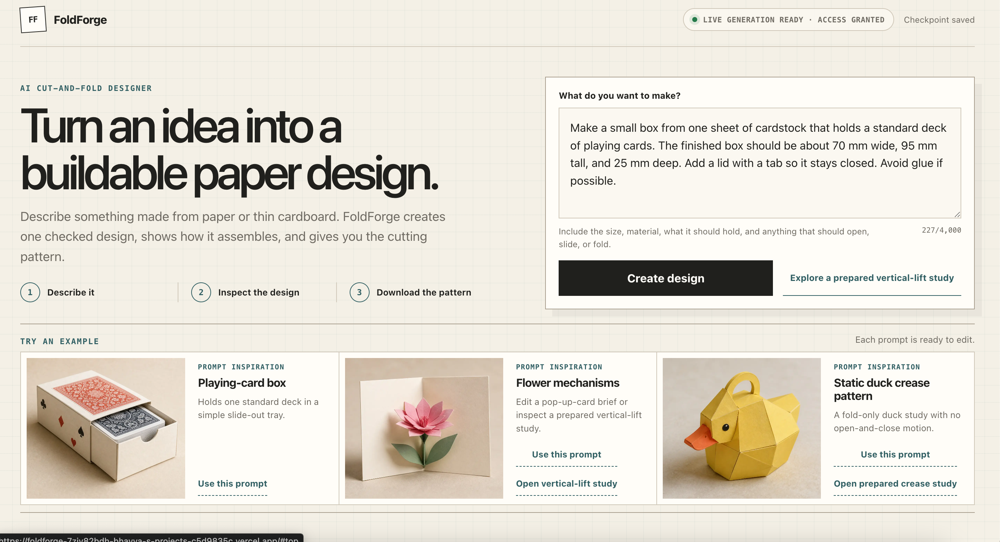
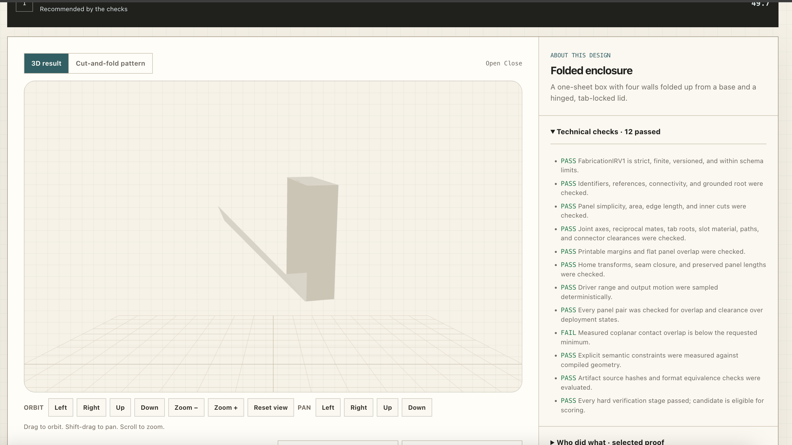
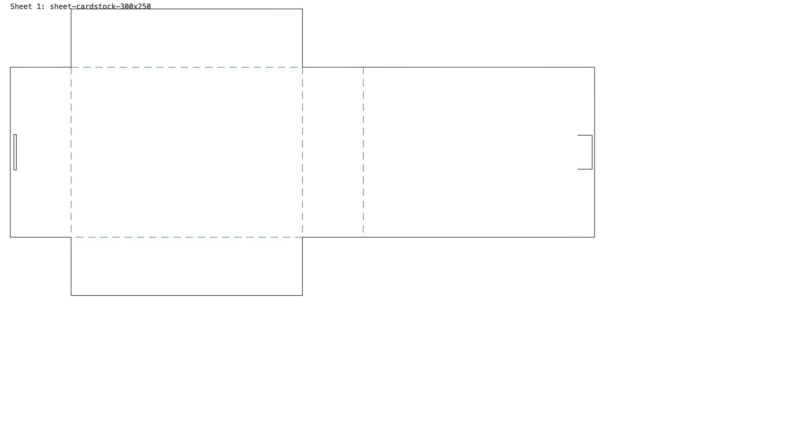

# FoldForge

Describe something made of paper or thin card, such as "a gift box 120 x 80 x 40 mm" or "a birthday card where a flower pops up". FoldForge produces a checked cut-and-fold design: a 3D preview you can rotate and animate, a print-scale cutting pattern, and the files to make it.



## How it works

1. **Understand the prompt.** An AI model (or, with no key, a built-in keyword reader) turns your text into a structured fabrication intent: object, size, motion, and stock.
2. **Design it.** The model proposes the parts and how they connect. Deterministic code synthesizes the actual panels, folds, tabs, and slots. If that fails, a parametric template fitted to your dimensions is used, and the result is labelled as a template.
3. **Check it.** Code verifies geometry, sheet packing, folding motion, collisions, and clearances. Nothing that fails is ever shown as valid.
4. **Export it.** Download SVG and DXF patterns (cut = solid, score = dashed), a GLB 3D model, the full JSON record, and FOLD when the design is representable.




## Run it

Requires Node.js 22+ and pnpm.

```bash
pnpm install
```

```bash
pnpm dev
```

Open http://localhost:3000.

**No key needed** for boxes, organizers, desk stands, pop-up cards, bookmarks and tags, and stand-up figures such as ducks, cats, rabbits, hearts, trees, houses, and stars (template mode).

**For any other object**, add a free AI key. Copy `.env.example` to `.env.local` and set:

```
AI_API_KEY=<your Google Gemini key from https://aistudio.google.com/apikey>
```

Groq, OpenRouter, a local Ollama model, or OpenAI also work through `AI_BASE_URL` and `AI_MODEL`; see `.env.example`.

## Develop

```bash
pnpm test
```

```bash
pnpm check
```

`pnpm check` runs lint, types, formatting, tests, export validation, and the production build, which is the same as CI. `pnpm test:e2e` runs the Playwright browser flow.

Code layout and engineering rules are in [AGENTS.md](./AGENTS.md); the fabrication model and verifier limits are in [FABRICATION_SPEC.md](./FABRICATION_SPEC.md).

## Limits

FoldForge handles flat sheets with panels, cuts, folds, tabs, slots, hinges, and sliders, with up to 24 panels and one manual motion. It does not model smooth curved surfaces, material strength, fatigue, or electronics. It verifies geometry and kinematics, not how well a real card stock holds up.

## License

MIT; see [LICENSE](./LICENSE) and [THIRD_PARTY_NOTICES.md](./THIRD_PARTY_NOTICES.md).
